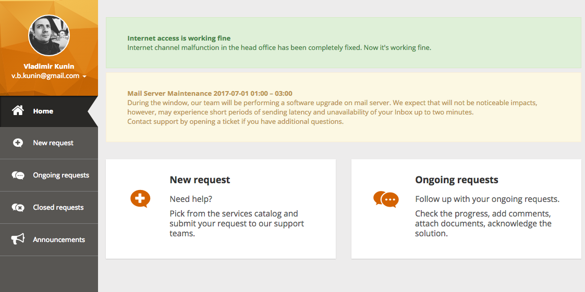
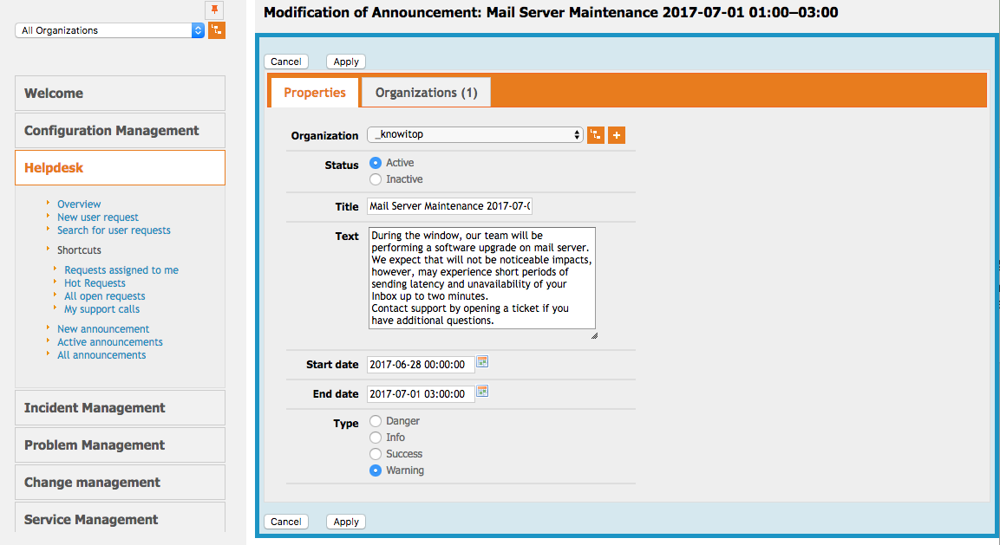
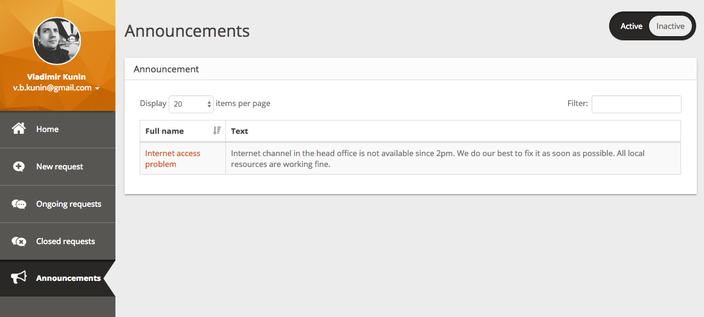

# knowitop-portal-announcement
## Объявления для пользователей нового портала Combodo iTop 2.3

**Разрботка модуля прекращена. Используйте аналогичное дополнение от Combodo: https://store.itophub.io/en_US/products/itop-communications.**

Модуль позволяет создавать объявления и информационные сообщения для пользователей клиентского портала.



Для объявления можно выбрать стилистическое оформление, период показа и заказчиков, сотрудники которых увидят объявление. Если период показа не задан, объявление будет отображаться постоянно. Объявление не отображается, если не выбран ни один заказчик.



В разделе Объявления (Announcements) на портале пользователю могут быть доступны снятые с показа объявления.



Чтобы включить раздел Объявления на портале, перед установкой модуля нужно активировать раздел `id="announcements-history"` в файле *datamodel.knowitop-portal-announcement.xml*:
 
```
<brick id="announcements-history" xsi:type="Combodo\iTop\Portal\Brick\ManageBrick" _delta="define">
  <active>false</active> <--- заменить false на true
  ...
</brick>
```

### Установка

Установка производится по стандартной схеме:
 1. Перекладываем папку *knowitop-portal-announcement* в *itop/extensions/*. __ВНИМАНИЕ!__ Проверьте ещё раз название папки модуля: *knowitop-portal-announcement*. 
 2. Разрешаем редактирование config-файла iTop *itop/conf/production/config-itop.php*.
 3. Переходим в браузере http://my-itop/setup и выбираем "Upgrade an existing iTop instance".
 4. На предпоследнем шаге ставим галочку напротив названия модуля и устанавливаем.
 5. Готово.
 
### Переход с версии для старого портала
Удалите старый модуль *portal-announcement* из папки *itop/extensions/* и выполните установку нового модуля по инструкции выше. Модель данных старого модуля совместима с новым, вносить изменения в БД не требуется.

### Ссылки
- [Мы Знаем iTop](http://knowitop.ru)
- [iTop ITSM & CMDB по-русски](http://community.itop-itsm.ru)
- [Сайт Combodo iTop](http://www.combodo.com/itop)
